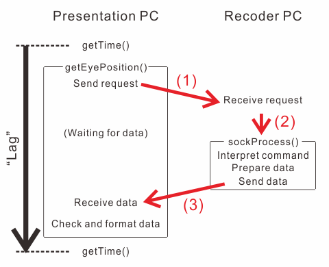
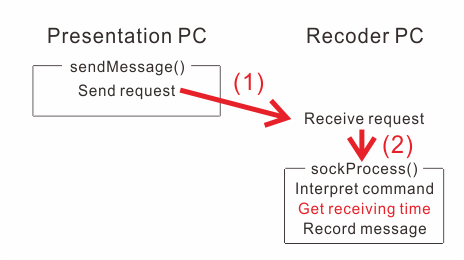

.. _pc_pc_delay:

Delay in communication between PCs
=======================================

Delay in sending a message from the Presentation PC to the Recorder PC spoils synchronization between gaze positon data and messages.
Although It is difficult to estimate this delay precisely, :ref:`Sample01<sample01>` provides come clues for this problem.
In the sample01, time spent in :func:`~GazeParser.TrackingTools.BaseController.getEyePosition` is recorded.

.. code-block:: python

            preGet = trialClock.getTime()
            eyePos= tracker.getEyePosition()
            postGet = trialClock.getTime()
            if not eyePos[0] == None:
                data.append((1000*preGet,1000*postGet,1000*(postGet-preGet),
                             targetPosition[0],targetPosition[1],eyePos[0],eyePos[1]))

In the local log file, time spent in :func:`~GazeParser.TrackingTools.BaseController.getEyePosition` is recorded at the third column (labeled 'Lag').
Unit of this value is milliseconds.::

    SentAt,ReceivedAt,Lag,TargetX,TargetY,EyeX,EyeY
    0.0,0.5,0.5,0,0,-6.0,-31.0
    14.3,14.9,0.6,0,0,-7.0,-27.0
    18.7,19.0,0.3,0,0,-7.0,-27.0
    33.9,34.2,0.3,0,0,-3.0,-30.0
    50.6,50.9,0.3,0,0,0.0,-30.0
    67.3,67.6,0.3,0,0,-6.0,-32.0
    84.0,84.3,0.3,0,0,-2.0,-30.0
    100.6,101.0,0.3,0,0,-2.0,-32.0
    117.3,117.6,0.3,0,0,-7.0,-30.0
    134.0,134.4,0.3,0,0,-4.0,-34.0
    150.7,151.0,0.3,0,0,-9.0,-31.0
    167.4,167.7,0.3,0,0,-11.0,-31.0
    184.1,184.4,0.3,0,0,-10.0,-30.0
    200.7,201.1,0.3,0,0,-6.0,-31.0
    217.4,217.7,0.3,0,0,-6.0,-33.0
    (snip)

For reference, the mean and standard deviation of this example output were 0.65ms and 0.79ms, respectively.
The mode was 0.3ms, and the maximum value was 3.8ms.
PCs used to generate this example output are shown in Table 1.
::

.. table:: Table 1

    ================ ============================================================
    Presentation PC  * Core i7 920
                     * Windows 7 Professional
                     * GeForce GTX 550 Ti
                     * PsychoPy 1.73
    Recorder PC      * Core2 Duo E8500
                     * Ubuntu 12.04
                     * GazeParser 0.5.1 OpenCV edition (USE_THREAD=1)
    ================ ============================================================

Figure 1 shows the inside of :func:`GazeParser.TrackingTools.BaseController.getEyePosition`.
The lag indicates time spent to do these tasks.
Probably time-consuming tasks are network transportation (1 and 3) and calling sockProcess() after receiving the request (2).

    
    Figure 1

Figure 2 shows the inside of :func:`~GazeParser.TrackingTools.BaseController.sendMessage`.
Timestamp of the message is determined immediately after sockProcess() function recognized that the received request is 'sendMessage'.
Because task (3) is unnecessary in :func:`~GazeParser.TrackingTools.BaseController.sendMessage`, delay in :func:`~GazeParser.TrackingTools.BaseController.sendMessage` must be shorter than that in :func:`~GazeParser.TrackingTools.BaseController.getEyePosition`.

    
    Figure 2

In conclusion, delay in sending message can be roughly estimated by running Sample01 several times.
The delay must be shorter than 'Lag' in the local log file of Sample01.

