.. _stim_cap_delay:

Delay from stimulus presentation to image capture
=======================================================

Delay estimation
---------------------

Suppose that we want to measure saccade lateny to a small dot briefly presented on a display using GazeParser and SimpleGazeTracker.
In such a case, 

* The dot is drawn on the back buffer and then the buffer is flipped to show the dot on the display.
* After flip is finished, a message is sent to the Recorder PC to record the onset time of the dot.
* Participant detects the dot and makes a saccade to it.
* Participant's eye movement is captured by a camera and sent to the Recorder PC.

This measurement would be simple if there was no delay but participant's response latency in these process:
however, unfortunately, there are many processes that would cause delay.
Following processes are main sources of delay.

1. Delay from calling flip (PsychoPy) or swap_buffers (VisionEgg) to updating the display
2. Delay from updating the display to capturing image by the camera.  For example, if sampling frequency of the camera is 60Hz, capture may be delayed about 16.7ms (i.e. 1/60sec) at worst.
3. Delay in transferring captured imaget to the Recorder PC.
4. Delay in transferring a message from the Presentation PC to the Recorder PC.

It is difficult to estimate these delay exactly, total delay can be roughly estimated by capturing stimuli on the display by the camera.
:func:`GazeParser.TrackingTools.cameraDelayEstimationHelper` is intended to help this estimation.
To use :func:`~GazeParser.TrackingTools.cameraDelayEstimationHelper`, adjust camera position so that the center of the display can be captured by the camera (Figure 1).

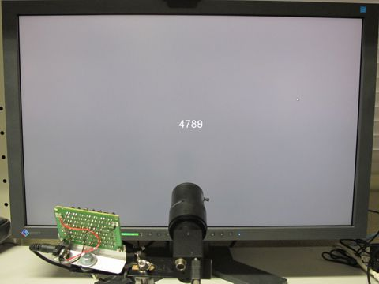
    
    Figure 1

Run SimpleGazeTracker on the Recorder PC, and then run a script like following examples on the Presentation PC.
Please modify screen size, camera image size and IP address if necessary.

.. code-block:: python
    
    #For PsychoPy users
    import psychopy.visual
    import GazeParser.TrackingTools
    
    tracker = GazeParser.TrackingTools.getController(backend='PsychoPy')
    tracker.setReceiveImageSize((640,480))
    tracker.connect('192.168.11.6')
    
    win = psychopy.visual.Window(size=(1920,1200),fullscr=True)
    GazeParser.TrackingTools.cameraDelayEstimationHelper(win, tracker)

.. code-block:: python
    
    #For VisionEgg users
    import VisionEgg.Core
    import GazeParser.TrackingTools
    
    tracker = GazeParser.TrackingTools.getController(backend='VisionEgg')
    tracker.setReceiveImageSize((640,480))
    tracker.connect('192.168.11.6')
    
    screen = VisionEgg.Core.get_default_screen()
    GazeParser.TrackingTools.cameraDelayEstimationHelper(screen, tracker)

As shown in Figure 1, these sample script shows a counter on the center of a PsychoPy/VisionEgg window.
When space key on the Presentation PC is pressed, :func:`~GazeParser.TrackingTools.cameraDelayEstimationHelper`
sends a request to save the latest camera image that has been transferred to the Recorder PC.
The saved image is named 'FILE######.bmp', where ###### is the counter number that is drawn on the last flipped buffer before key press.
To stop script, press ESC key.

If there was no delay, the number in the filename should be equal to the number captured in that image.
Usually, the number in the image is smaller than the number in the filename due to delay.
Figure 2 shows how the number in the image delays from the number in the filename.
(1) to (4) in Figure 2 correspond to four sources of delay described above.

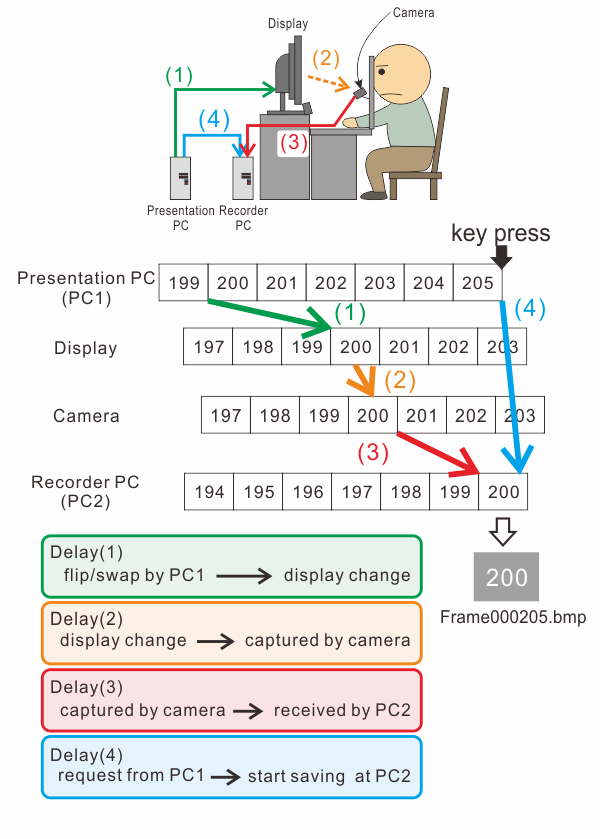
    
    Figure 2

Figure 3 and 4 show examples of images obtained by :func:`~GazeParser.TrackingTools.cameraDelayEstimationHelper`.
Apparatus for these examples are shown in Table 1.
When PsychoPy ran in window mode (Figure 3), difference between numbers were 5 or 6 in most cases.
Considering reflesh rate of the display (60Hz), delay should be approximately 80-100 ms!

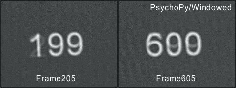
    
    Figure 3

When PsychoPy ran in full screen mode (Figure 4), difference between numbers were 4 in most cases.
Although delay was reduced compared to that in window mode, it is not negligibly small (approximately 60-70 ms).

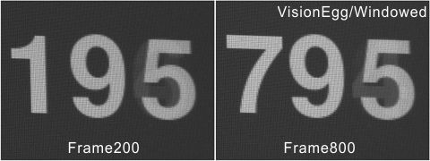
    
    Figure 4

.. table:: Table 1

    ================ ============================================================
    Presentation PC  * [CPU] Core i7 920
                     * [GRAPHIC] GeForce GTX 550 Ti
                     * [LCD] EIZO S2411W (60Hz)
                     * Windows 7 Professional SP1
                     * Python 2.7.2
                     * PsychoPy 1.73.04
    Recorder PC      * [CPU] Core2 Duo E8500
                     * [CAMERA] IMI Tech IMB-11FT (IEEE1394 camera)
                     * Ubuntu 12.04
                     * GazeParser 0.5.1 OpenCV edition (USE_THREAD=1)
    ================ ============================================================

Unfortunately it is not clear why the delay is so long.  Probably (2) would be shorter than frame duration (16.7ms).
(4) would be a few milliseconds considering time spent by :func:`~GazeParser.TrackingTools.BaseController.getEyePosition` (see :ref:`pc_pc_delay`).
Therefore, the delay should be approximately equal to sum of (1) and (3).  Further investigation is necessary to determin sources of the delay.

Delay correction
---------------------

In my experience, the delay is almost constant as far as the same hardware is used.  SimpleGazeTracker has 'DELAY_CORRECTION' option to correct constant delay (See als :ref:`config-simpleazetracker`).
The value of this parameter is added to timestamp when SimpleGazeTracker received a message.  In the case of Figure 3, setting DELAY_CORRECTION=60 would be correct the delay.

**It is worth noting that (1) is a common source of delay to all experiments using PsychoPy and VisionEgg (and probably other libralies depending on OpenGL).
This correction may cause short saccade latency compared to measurement with other eye trackers and PsychoPy/VisionEgg.**

Estimating delay in the Recorder PC
-------------------------------------------------------

To evaluate the delay in detail, eye movement was concurrently recorded by SimpleGazeTracker and direct-current electrooculography (DC-EOG).
Apparatus are shown in Table 2.

.. table:: Table 2

    ================ ==================================================================
    Presentation PC  * [CPU] Core2 Duo E6550
                     * [GRAPHIC] GeForce 8600 GTS
                     * [LCD] EIZO EV2313W (60Hz)
                     * Windows XP Professional SP3
                     * Python 2.5.4
                     * VisionEgg 1.2.1
    Recorder PC      * [CPU] Core i7 950
                     * [Camera]
                         - IMPERX Bobcat ICL-B0620 (@250Hz, for GPC5300 edition)
                         - OptiTrack V120Slim (@120Hz. for OptiTrack edition)
                         - IMI Tech IMB-11FT (@60Hz, for OpenCV edition threading mode)
                     * [DC-OEG] NIHON KODEN AN-601G with Interface PCI-3166
                     * Windows 7 Professional SP1
                     * GazeParser 0.5.1 all edition
    ================ ==================================================================

After an image is captured by a camera, the image is transferred to the Recorder PC.
Because SimpleGazeTracker runs on preemptive maltitasking operating system, there may be a lag from image transfer to image analysis.
There may be also a lag from the end of image analysis to recording (timestamp indicates the time when recording starts).
In this test, output of DC-EOG is read immediately after recording was started.
Reading DC-EOG output usually complets very quickly (less than 1ms).
Comparing the results of image analysis with the output of DC-EOG, delay from image capture to recording can be evaluated (Figure 5).

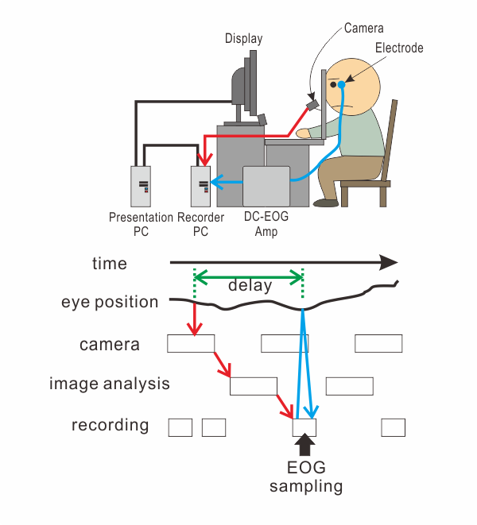
    
    Figure 5

Figure 6 shows representative results. Blue lines and green lines show horizontal gaze position recorded by DC-EOG and SimpleGazeTracker, respectively.
The blue and green lines were quite close with each other when the data were recorded at 250Hz (top row, SimpleGazeTracker GPC5300 edition).
On the other hand, the blue line preceded the green line when the data were recorded at 60Hz (bottom row, SimpleGazeTracker OpenCV edition).

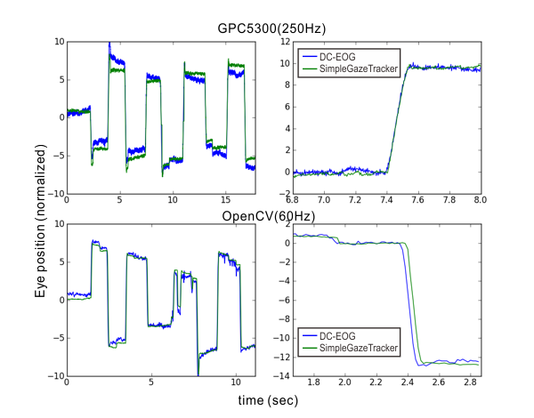
    
    Figure 6

To estimate delay between two lines, cross correlation of the blue and green lines was calculated (Figure 7).
Recording was performed twice for each SimpleGazeTracker edition.
Low corss correaltion in OptiTrack ediion ('Opti1' and 'Opti2') was due to measurement noise in DC-EOG.
The cross correlation was the highest when he delay was assumed to be 1 or 2 sampling interval of the camera.
That is, the delay from image capture to recording is considerd to be about 1-2 sampling interval of the camera.

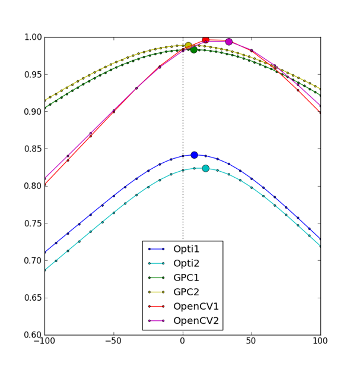
    
    Figure 7

Estimating delay in the Presentation PC
---------------------------------------------

It is considered that CRT dislpay has better temporal characteristics compared to LCD.
Figure 8 shows the results of :func:`~GazeParser.TrackingTools.cameraDelayEstimationHelper` with CRT (EIZO E57T) and LCD (EIZO EV2311W).
Other apparatatus than display were identical.
As far as comparison of these displays, there was no prominent difference between CRT and LCD.

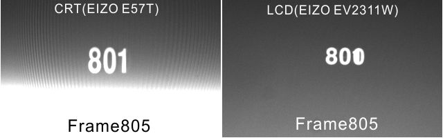
    
    Figure 8

Figure 9 shows the results of :func:`~GazeParser.TrackingTools.cameraDelayEstimationHelper` running on Windows XP SP3 and Ubuntu 12.04.
These operating systems run on the same PC.  Other apparatus were also identical.
The graphic card on the presentation PC was GeForce GTX 260.  Driver of the graphic card was genuine driver version 296.10 for Windows XP and 295.40 for Ubuntu.
Im many cases, difference between number in the filename and in the image was 4 in both operating systems: however, the difference was 3 more fluently in XP than in Ubuntu.
Delay in the Presentation PC may change depending on operating system and driver version.

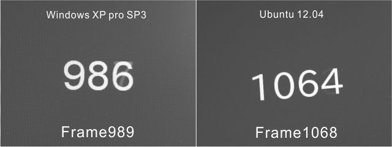
    
    Figure 9

To estimate delay in the Presentation PC more accurately, I measured luminance of the display using a photodiode.
A photodiode was placed near the edge of the display (Figure 10), and output of the photodiode was recorded by an A/D converter installed on the Presentation PC (Figure 11).

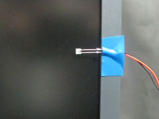
    
    Figure 10

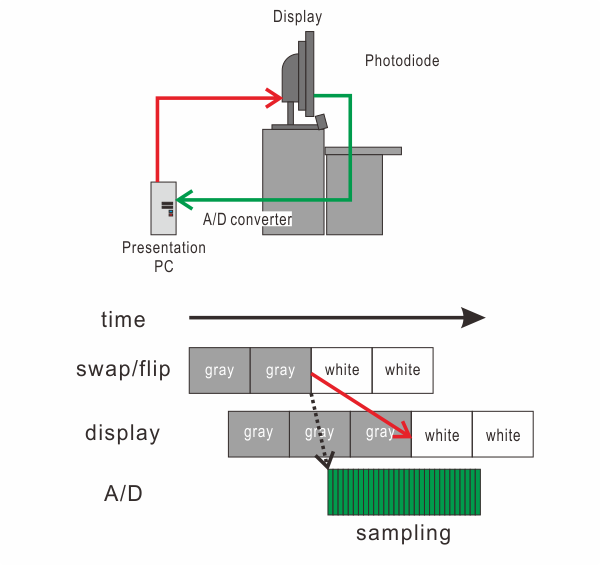
    
    Figure 11

During measurement, the entire screen was repeadedly changed from gray to white and white to gray.
Immediately after a method that changes the screen from gray to white (i.e. psychopy.visual.Window.flip() or VisionEg.Core.swap_buffers())was called, output of the photdiode was recorded for 100 milliseconds.
Apparatus are shown in Table 3. PsychoPy and VisionEgg were tested on the same hardware.

.. table:: Table 3

    ================ ==================================================================
    Presentation PC  * [CPU] Core2 Duo E6550
                     * [GRAPHIC] GeForce 8600 GTS
                     * [LCD] EIZO EV2313W (60Hz)
                     * Windows XP Professional SP3
                     * Python 2.5.4
                     * VisionEgg 1.2.1
                     * PsychoPy 1.74.03
    Recorder PC      * [CPU] Core i7 950
                     * [Camera] IMPERX Bobcat ICL-B0620 (250Hz)
                     * [DC-OEG] NIHON KODEN AN-601G with Interface PCI-3166
                     * Windows 7 Professional SP1
                     * GazeParser 0.5.1 GPC5300 edition
    ================ ==================================================================

Figure 12 shows the output of the photodiode averaged over 100 measurements.
Ignoring delay in starting recording (black dotted arrow in Figure 11), time of the rising edge of the output from the beginning of the recording correspond to the delay between flip()/swap_buffers() and actual display change.
The delay was approximately 17ms when PsychoPy was used. On the other hand, the delay reached approximately 67ms when VisionEgg was used even though the hardware was exactly the same.

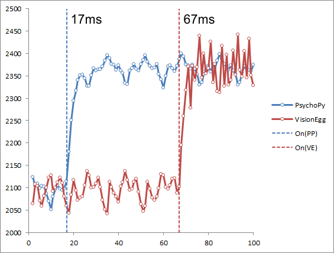
    
    Figure 12

To verify this result, I measured delay of the same system using :func:`~GazeParser.TrackingTools.cameraDelayEstimationHelper`.
The reuslts were shown in Table 4.
Assuming that difference of 1 frame corresponds to 16.7ms, these results were nearly the same as the delay estimated from Figure 12.
This means that the entire delay is mainly determined by delay in the Presentation PC when a high-speed camera is used.

.. table:: Table 4

    =========== =================== ============================================
    Library     difference (frames) delay (msec, estimated by differene*1000/60)
    =========== =================== ============================================
    PsychoPy    1.27 (SD = 0.32)    21.15 (SD = 5.39)
    VisionEgg   4.06 (SD = 0.18)    67.71 (SD = 2.82)
    =========== =================== ============================================

.. note::
    These results **do not** mean that PsychoPy is always better then VisionEgg.
    For example, PsychoPy exhibited 4-frames delay in Figure 4.
    Delay in the Presentation PC depends on the hardware, device driver and stimulus presentation library.

Summary
-------------------

* There is a delay between stimulus presentation and recorded gaze position in the GazeParser/SimpleGazeTracker system.
* Delay in the Recorder PC is approximately one interval of image capture.
* When a high-speed camera is used with te Recorder PC, the entire delay is mainly determined by delay in the Presentation PC.
* Delay in the Presentation PC reaches about 100ms at the worst depending on the hardware, device driver and stimulus presentation library.

