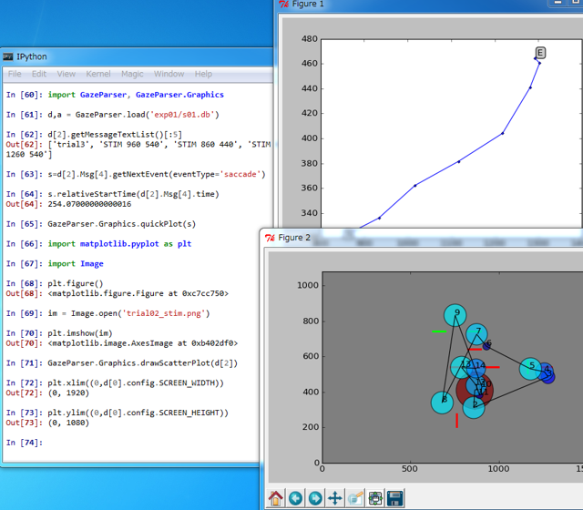
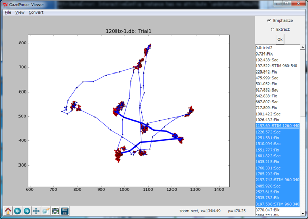
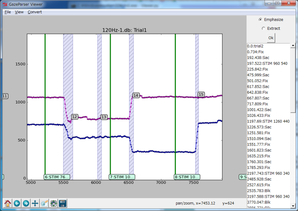
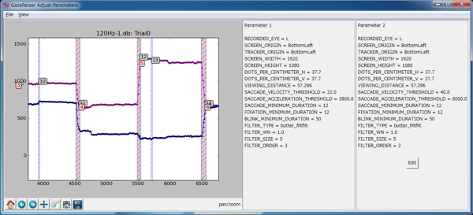

GazeParser is an open-source library for low-cost gaze tracking, parsing and visualizing.

News
==================
**2012/06/28**
    GazeParser 0.5.0alpha is released. See :doc:`changelog` for detail.

**2012/05/24**
    GazeParser 0.4.1 is released. See :doc:`changelog` for detail.

**2012/05/10**
    GazeParser 0.4.0 is released.

Contents
============

.. toctree::
   :maxdepth: 2
   
   ins/index
   cnf/index
   rec/index
   tut/index
   app/index
   ref/index
   changelog

Indices and tables
==================

* :ref:`genindex`
* :ref:`modindex`
* :ref:`search`

ScreenShot
============

Interactive data analysis on Python shell.

Data viewer (under development)

Data viewer (under development)

Interactive configuration editor (under development)

