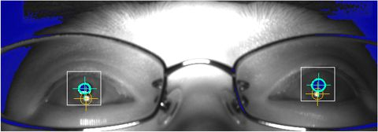
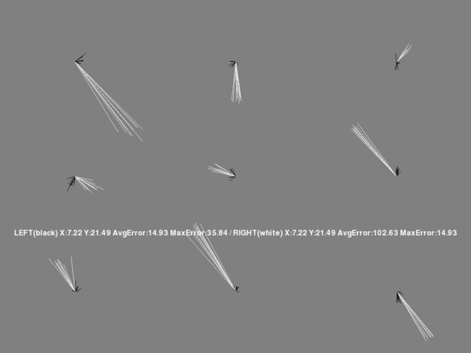
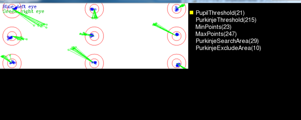
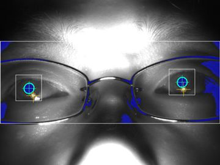

[Tentative] binocular recording mode
=====================================

SimpleGazeTracker has binocular recording mode, which is currently under testing.

Setup and calibration
--------------------------

To enable binocular recording mode, set BINOCULAR=1 in the CONFIG file (:ref:`config-simpleazetracker`).
Then, set image size of camera very wide (such as 640x240).

Basic operations is the same as those in monocular mode.
Adjust position of camera and IR illumination so that pupil and the Purkinje image of both eyes are detected (Figure 1).
SimpleGazeTracker assumes that pupil whose center is in the left half of the image is right eye and vice vasa.

    Figure 1

Figure 2 shows an example of calibration results display on the Presentation PC.
Black lines indicate the results for the left eye.  White lines indicate the results for the right eye.
In this example, the results for the left eye is very good while the results for the right eye is poor.
Probably readjustment and recalibration are necessary.

    Figure 2

On the Recording PC, the results for left and right eye are indicated by blue and green lines, respectively (Figure 3).

    Figure 3

Although it is highly recommended to use cameras whose image size can be configured to be very wide, you can set ROI to achieve very wide image.
In the case shown in Figure 4, camera's image size is 640x480 and ROI is set to 640x240.
See :ref:`set-roi`.

    
    Figure 4

Programming
--------------------------

There are two points to note.

1. RECORDED_EYE option should be set to 'B' when :func:`~GazeParser.TrackingTools.BaseController.sendSettings`. is called.

    .. code-block:: python
       :emphasize-lines: 2
       
       config = GazeParser.Configuration()
       config.RECORDED_EYE = 'B'
       config.VIEWING_DISTANCE = 57.3
       # (snip)
       tracker.sendSettings(config.getParametersAsDict())

2. :func:`~GazeParser.TrackingTools.BaseController.getEyePosition` returns a tuple of four elements (not two elements).
The returned values represent Left X, Left Y, Right X and Right Y, respectively.

