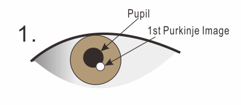
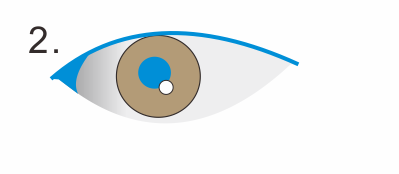
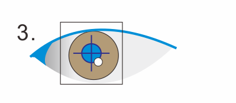
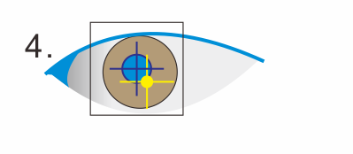

.. _measurement-principle:

Measurement principle of SimpleGazeTracker
==================================================

Detecting eye position
----------------------

SimpleGazeTracker estimates gaze direction from position of the reflection of a light source from outer surface of the cornea (corneal reflextion method).
This image is called *the first Purkinje image*.
One of a weak point of corneal reflection method is that very slight head movement may affect recording quality.
To overcome this problem, SimpleGazeTracker uses position of the first Purkinje image relative to the center of pupil.

1. Pupil and the first Purkinje image appear in the captured image like this. Note that the captured image is actually monochrome.

2. Firstly, the captured image is binarized and areas darker than the threshold.

3. Ellipse is fitted to the extracted areas. Sizes and shapes of the fitted ellipses are examined.
If only one ellipse was found whose size and shape seems to be the pupil, this ellipse is supporsed to be the pupil candidate.
Then, a square region is definded around the center of the pupil candidate.

4. The first Purkinje image is searched within the square region.
Areas brighter than the threshold are extracted.
The area nearest to the center of the pupil candidate is supporsed to be the first Purkinje image.

5. Contour of the pupil candidate near to the first Purkinje image is removed and an ellipse is re-fitted to the pupil candidate.
This procedure improves accuracy of estimating the pupil center when the First purkinje image is overlapped to the edge of the pupil.

.. image:: principle005.png

Calibration
----------------------

Let (U,V) denote position of the center of the first Purkinje image relative to the center of the pupil.
SimpleGazeTracker maps (U,V) to the gaze position on the screen coordinate by quite simple way.

.. math::
    (X,Y) = (a_x U + b_x Y +c_x, a_y U + b_y V + c_y)

..
    Communicating with Presentation PC
    ----------------------------------

