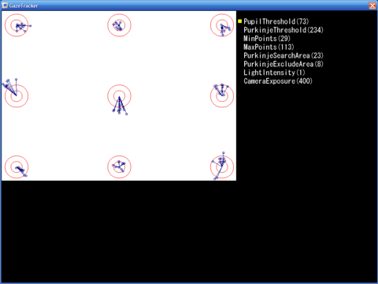
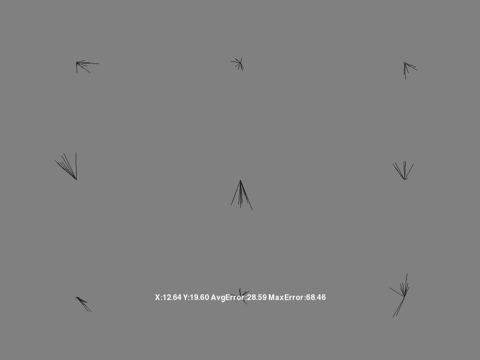
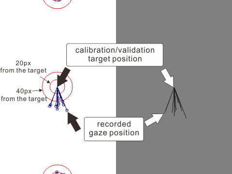
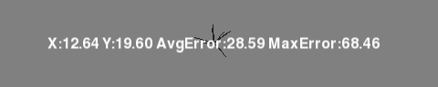

.. _calibration-procedure-label:

Calibration procedure
========================

Typical calibration procedure is like following.

1. Start SimpleGazeTracker on the Recorder PC. SimpleGazeTracker should be started before calling connect() on the Presentation PC; otherwise, connect() may be failed.

2. Start a script for stimulus presentation. When calibrationLoop() is called in the script, "calibration loop" is started. Use following keys to adjust parameters and perform calibration. You can use the keyboard of both the Recorder PC and the Presentation PC.
If you want to record your eye movement alone, you can do all operation from the Presentation PC.

**Up**
    Select menu item on the Recorder PC.

**Down**
    Select menu item on the Recorder PC.

**Left**
    Decrease parameter value.

**Right**
    Increase parameter value.

**Z**
    Toggle camera image on the Presentation PC. Turn the image off if you want to hide camera image from participant.

**X**
    Toggle camera image and calibration results display.

**C**
    Start calibration.

**V**
    Start validation. Calibration must be performed in advance.

**Q**
    Abort SimpleGazeTracker.

**ESC**
    Exit calibration procedure to start recording.

**SPACE**
    Start calibration/validation.

.. figure:: procedure000.png
    
    Figure 1

3. Adjust the camera position and parameters if necessary.  See :ref:`adjusting-camera` for detail.

4. Do calibration. Ask your participant to track moving small square.

5. Verify calibration results. If calibration quality is satisfactory, press ESC key to finish calibration loop; otherwise, go back to 3.

Calibration results display
============================

When calibration is finished, the screen of both PCs are automatically turned into calibration results display.
Figure 2 shows an example of the calibration results display on the Recorder PC.

    
    Figure 2

On the presentation PC, the calibration results display looks like Figure 3.
Note that the camera image must be turned on (use Z key to toggle on/off).

    
    Figure 3

Radial lines in the calibration results display shows the distance between the target position and the gaze position while the target was presented (Figure 4).
Shorter lines means better quality of calibration.
On the Recorder PC, circles are drawn around the target potision. The radius of the inner circles and the outer circles are 20px and 40px, respectively.

    
    Figure 4

On the Presentation PC, the summary of calibration quality is presented (Figure 5).
*X* and *Y* indicate the ratio of linear regression coefficients to screen size. smaller values mean better quality.
*AvgError* indicates the mean *absolute error*, i.e. the mean distance between the target position and the gaze position.
The average for all target positions is shown.
*MaxError* indicates the maximum distance between the target position and the gaze position.
Note that the unit of *AvgError* and *MaxError* is the screen coordinate.
Smaller values of *AvgError* and *MaxError* mean better quality.

    
    Figure 5

