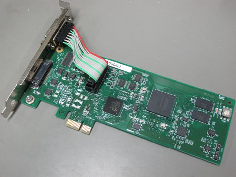
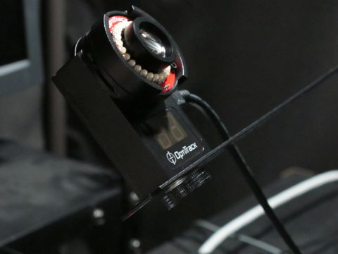
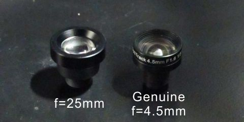
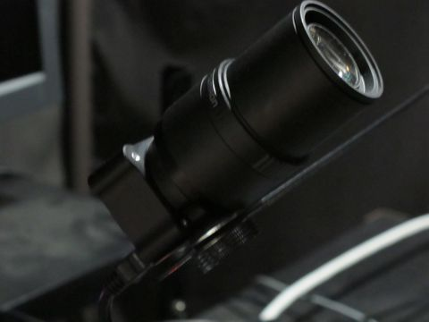
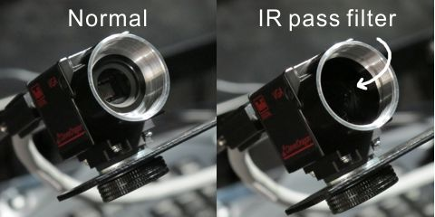
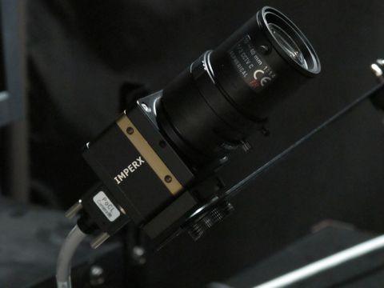

Required hardware for recording
================================

Two personal computers, a camera unit and forehead/chin-rest are necessary to use GazeParser.Tracker.

**Personal computer for recording**
    This PC must have an appropriate interface to connect the camera unit (e.g. USB2.0) and a wired network interface.
    *Operating system of the Recorder PC must be Windows XP, Vista or 7.*

**Personal computer for presentation**
    This PC must have a wired network interface.  Use of a decent graphics card is recommended for precise stimulus presentation.

**Camera unit**
    See below for supported cameras. If the camera unit does not have integrated lighting, an infrared lighting unit is alos necessary.

**Forehead/chin-rest**
    Current version of GazeParser.Tracker does not support head motion correction. It is necessary to restrict participant's head motion with a head/chin-rest.

Supported camera
=================

Currently, there are two editions of GazeParser.Tracker.

**OptiTrack edition**
    This edition supports OptiTrack `V100R2 <http://www.naturalpoint.com/optitrack/products/v100-r2/>`_ and `V120Slim <http://www.naturalpoint.com/optitrack/products/v120-slim/>`_ (NaturalPoint, Inc.).
    These cameras have USB2.0 interface and can capture images at 100 - 120 frames per second. See *Cameras used for development*.

**CameraLink edition**
    This edition currently supports CameraLink image grabbers manufactured by `Interface Corporation <http://www.interface.co.jp/>`_.
    Capturing frame rate depends on the specification of the connected camera.

.. note:: installer for CameraLink edition will be available for download soon.

Cameras used for development
=============================

OptiTrack V100R2
----------------

- Pros

    * Affordable price
    * No additional interface hardware is necessary (USB2.0 interface)
    * Embedded IR illumination (No additional IR light is necessary)
- Cons

    * Relatively slow speed (100fps)
- Note

    * Focal length of the genuine lens (f=4.5mm or 5.5mm) is too short for gaze tracking. M12-mout lens with longer focal length (e.g. 25mm) is necessary.

OptiTrack V120slim
------------------

Pros
    * Relatively affordable price (Although camera unit is not so expensive, IR illumination and CS-mount lens are necessary)
    * No additional interface hardware is necessary (USB2.0 interface)

Cons
    * IR illumination and CS-mount lens are necessary

Note
    * 800nm IR pass filter option is recommended.

Toshiba Teli CleverDragon CSCV90BC3
-----------------------------------

.. figure:: cam_CSCV90BC3.jpg

Pros
    * Customizable camera speed
    * less expensive than ICL_B0620

Cons
    * IR illumination and C-mount lens are necessary
    * CameraLink interface board is necessary

Note
    * Inserting IR pass filter between the sensor and the lens would reduce measurement noise.

IMPERX Bobcat ICL-B0620
-----------------------

Pros
    * High-speed image capture (260fps in default, works at 500fps or higher depending on the recorder PC)

Cons
    * expensive
    * IR illumination and C-mount lens are necessary
    * CameraLink interface board is necessary

Note
    * Inserting IR pass filter between the sensor and the lens would reduce measurement noise.

