Hardware setup
==================================================

Two computers (PC) are necessary to use the SimpleGazeTracker.
The first PC grabs ocular image and estimate  gaze position (Recorder PC).
The other PC presents stimuli to a participant (Presentation PC).

1. Connect the Recorder PC and Presentation PC with a LAN cable.
Assign a fixed IP address to each PC.
It is recommended that these PCs should not be connected to global network.

2. Connect a camera unit to the Recorder PC. If the camera requires specific 
software, install them.

3. Install SimpleGazeTracker to the Recorder PC.

4. Set a head- and chin-rest in front of a participant.
Recording without a head- and chin-rest is not recommended.
Place the camera in front of participant's left or right eye (Figure 1).
The vertical level of the camera was lower than the eye so that the camera did not disturb the participant viewing the display.
If the camera need a separate light source, place it in front of the participant.
The lighting should not be on-axis to avoid *red eye*.

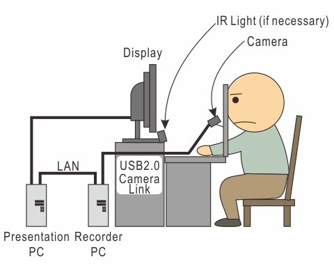
   
   Figure 1

Figure 2, 3 and 4 shows an example of setting. The camera unit is `IMPEREX ICL-B0620 <http://www.imperx.com/bobcat>`_.
The head- and chin-rest are made of angle steels. The camera is mounted on the head- and chin rest.
An IR LED lighting is placed below the display.

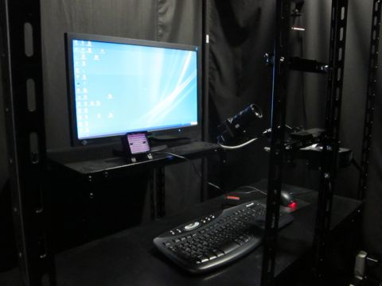
   
   Figure 2

.. figure:: setup003.jpg
   
   Figure 3

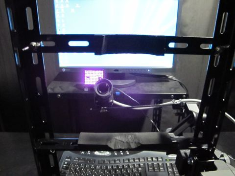
   
   Figure 4

.. _adjusting-camera:

Adjusting camera (monocular recording)
==================================================

Start SimpleGazeTracker and confirm that camera image is presented on the display of the Recorder PC.
If SimpleGazeTracker does not start, please confirm that the camera unit is recognized by the Recorder PC (see instruction of your camera device).
If no camera image is appeared nevertheless SimpleGazeTracker seems to be running, please make sure that you have properly positioned the light source.

Ask your participant to sit on a chair and put his/her head on head- and chin-rest.
Adjust the position and the orientation of the camera so that either left or right eye of the participant is captured as large as possible.

Adjust parameters for detecting the pupil and the first Purkinje image using the up, down, left and right cursor keys on the keyboard (see :ref:`calibration-procedure-label` for key bindings).
Note that you can forward the camera image to the Presentation PC and use the keyboard of the Presentation PC if you are going to record your eye movement alone.
The meaning of the parameters are following.

**PupilThreshold**
    Suppose that the area darker than this value in the camera image may be the pupil.  This value have to be adjusted for each participant.

**PurkinjeThreshold**
    Suppose that the area brighter than this value in the camera image may be the first Purkinje image.  Usually, this value doesn't have to be modified after it has been set up once because this valude mainly depends on the camera and the light source.

**MinPoints**
    Areas whose contour is shorter than this value is not considered as the pupil.  Usually, this value doesn't have to be modified after it has been set up once because this valude mainly depends on camera settings.

**MaxPoints**
    Areas whose contour is longer than this value is not considered as the pupil.  Usually, this value doesn't have to be modified after it has been set up once because this valude mainly depends on camera settings.

**PurkinjeSearchArea**
    Specify the size of the area to explore the first Purkinje image. This value may be adjusted for each participant.

**PurkinjeExcludeArea**
    Specify the distance from the first Purkinje image for re-fitting ellipse to the pupil. See :ref:`measurement-principle` for detail.

**Intensity (only for OptiTrack V100R2)**
    Adjust intensity of the embedded IR LED lighting.

**Exposure (for OptiTrack V100R2, V120Slim)**
    Adjust exposure duration of the camera unit.

Run SimpleGazeTracker on the Recorder PC and inspect the camera image.
Figure 5 shows an example of good recording condition.
The pupil is colored in blue and the first purkinje image is marked.

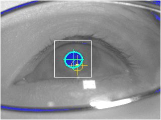
   
   Figure 5

If the area around the pupil is also colored in blue (Figure 6), the threshold for detecting pupil is too low.
Decrease **PupilThreshold**. Otherwise, adjust settings of the camera (such as shutter speed) and/or the light source.

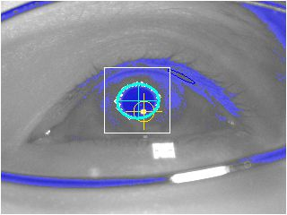
   
   Figure 6

If only a part of the pupil is colored in blue (Figure 7), the threshold for detecting pupil is too high.
Increase **PupilThreshold**. Otherwise, adjust settings of the camera (such as shutter speed) and/or the light source.

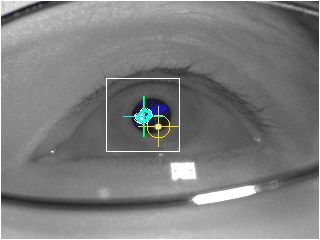
   
   Figure 7

In the following example (Figure 8), the camera is so distant that facial parts other than the eye are also captured.
Such settings may decrease recording speed because the SimpleGazeTracker has to reject non-pupil dark areas.
Furthermore, small pupil image decrease recording quality because it is difficult to estimate pupil center accurately.
Please adjust camera position and/or change camera lens.

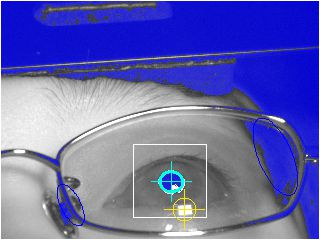
   
   Figure 8

In the following example (Figure 9), the camera is not properly focused on the pupil.
In addition, the lens of the eyeglasses is not clean.

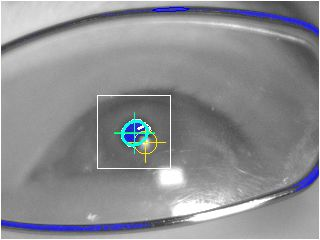
   
   Figure 9

In the following example (Figure 10), reflection of the light source on the eyeglasses hides the pupil.
Position of the camera and the light source have to be adjusted.
Note that the eyeglasses sometimes slips down while recording, resulting in a condition similar to this example.

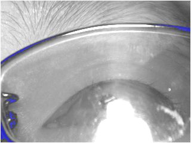
   
   Figure 10

The size of the **PurkinjeSearchArea** (white rectangle in the camera image) should be large enough to include the first Purkinje image within it.
In the case shown in Figure 11, **PurkinjeSearchArea** may be so small that the first Pukinje image may move out from the **PurkinjeSearchArea** when participant looked on the corner of the display.

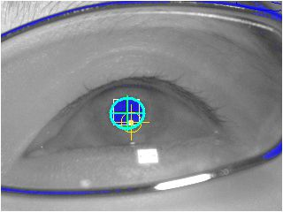
   
   Figure 11

On the other hand, detection of the first Purkinje image maybe failed if the size of the **PurkinjeSearchArea** is too large.
In the case shown in  Figure 12, a reflection of the light source on the eyeglasses is erroneously marked as the first Purkinje image.

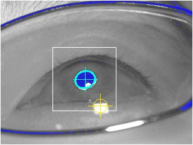
   
   Figure 12

**PurkinjeExcludeArea** (yellow circle) may be too large in the example shown in Figure 13.
More thean the half of the contour of the pupil should be outside of the yellow circle.

.. figure:: settings109.jpg
   
   Figure 13

In the following example (Figure 14), the contour of the pupil may be move out from the camera image.
The position of the camera must be adjusted.

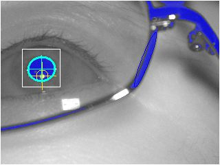
   
   Figure 14

