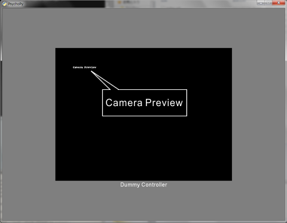
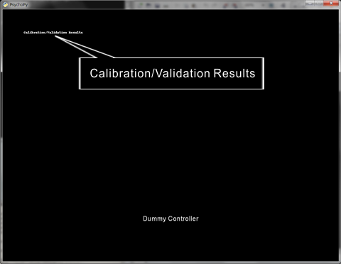

Dummy mode of GazeParser.TrackingTools for standalone testing
================================================================

GazeParser.TrackingTools has *dummy mode* to help writing scripts when SimpleGazeTracker is not available.
To use dummy mode, create an controller object with *dummy=True* option.
::

    from GazeParser.TrackingTools import getController
    
    #PsychoPy
    tracker = getController(backend='PsychoPy',config='TrackerSettings.cfg', dummy=True)
    
    #VisionEgg
    tracker = getController(backend='VisionEgg', config='TrackerSettings.cfg', dummy=True)

The dummy controller shows black filled rectangle when camera preview and calibration results are requested (Figure 1 and 2).

    
    Figure 1

    
    Figure 2

The dummy controller output commands to the standard output instead of sending commands to SimpleGazeTracker.
This is an example of output::

    connect (dummy)
    openDataFile (dummy): participant001.csv
    sendSettings (dummy)
    Dummy sendCommand: toggleCalResult 
    Dummy sendCommand: startCal -409,-307,409,307 
    Dummy sendCommand: getCalSample 307,230 
    Dummy sendCommand: getCalSample 0,230 
    Dummy sendCommand: getCalSample -307,0 
    Dummy sendCommand: getCalSample -307,230 
    Dummy sendCommand: getCalSample 307,-230 
    Dummy sendCommand: getCalSample -307,-230 
    Dummy sendCommand: getCalSample 0,0 
    Dummy sendCommand: getCalSample 0,-230 
    Dummy sendCommand: getCalSample 307,0 
    Dummy sendCommand: endCal 
    startMeasurement (dummy): 
    stopMeasurement (dummy): 
    startRecording (dummy): trial1
    sendMessage (dummy): STIM 0 0
    sendMessage (dummy): STIM -300 -200
    sendMessage (dummy): press space
    sendMessage (dummy): STIM 200 -200
    
    (snip)
    
    sendMessage (dummy): STIM 100 100
    sendMessage (dummy): STIM -300 200
    sendMessage (dummy): STIM 100 -100
    stopRecording (dummy): end trial
    close (dummy)

The dummpy contoller's :func:`~GazeParser.TrackingToosl.BaseController.getEyePosition` returns mouse cursor position instead of current gaze position.
Gaze-contingent stimulus presentation can be tested using a mouse.

.. note:: Currently, units of the windows must be 'pix' or the same to that of getEyePosition() when PsychoPy backend is used
    (VisionEgg backend does not support 'units').

