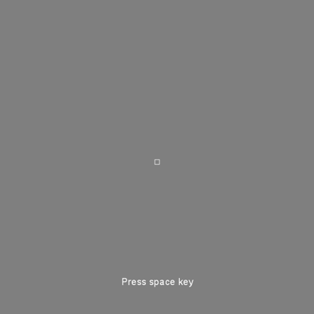
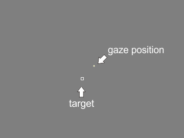

.. _sample01:

Sample 01: Controlling SimpleGazeTracker from GazeParser.TrackingTools
=======================================================================

What does this sample do?
--------------------------

This sample shows how to do following tasks from GazeParser.Tracker.

- how to initialize SimpleGazeTracker
- how to perform calibration
- how to start/stop recording
- how to send messages to SimpleGazeTracker
- how to get current eye position

When this sample script is started, the script asks you following information (Figure 1).

.. figure:: sample01_001.png
    
    Figure 1

========================= ===============================================================
Item                      Description
========================= ===============================================================
Datafile name             Name of datafile created by SimpleGazeTracker.
                          '.csv' is automatically appended.
                          Non-ascii charactors are not supported.
                          In this sample script, a log file is created on the
                          Presentation PC. Name of the log file is also determined by 
                          this parameter.
SimpleGazeTracker address IP address of SimpleGazeTracker.
Capture image size        Image size of camera unit used by SimpleGazeTracker.
                          If you set ROI, this parameter must be equalto ROI size.
                          Width and height must be separated by a comma.
Use dummy mode            If this box is checked, scripts runs with dummy mode.
                          That is, scripts runs without connecting to SimpleGazeTracker.
========================= ===============================================================

After you fill information and press OK, gray screen is presented and calibration loop is started.
You can use Z, X, C, V and cursor keys to inspect camera image and perform calibration and validation.
See :ref:`adjusting-camera` and :ref:`calibration-procedure` for detail.

To terminate calibration loop, press 'q' or ESC key.  If 'q' key is pressed, the script is terminated.
If ESC key is pressed, the script checked whether calibration has been performed.
Calibration loop stops if calibration has been performed at least once.
Otherwise, calibration loop runs continuously.

After calibration loop is terminated, a small square is presented on the center of the screen.
Below the square, a message 'Press space key' is presented (Figure 2).
Participant is requested to fixate the square and to press space key.
Distance between the square and measured gaze position are calculated to verify recording quality.
In this sample, the distance is simply saved to a log file.

    
    Figure 2

Immediately after space key is pressed, a trial is started.  A small square (target) is presented on the screen.
Participant is requested to fixate the target and press space key.
After space key is pressed, the target randomly jumps ten times.  Interval between jumps is onse second.
Participant is requested to follow the target by eye movement.
The script asks participant's gaze position every frame and draw a small yellow square at the gaze position (Figure 3).
If you run the script as the dummy mode, you can emurate particiapnt's gaze position by mouse.
One second after 10th jump, the trial is finished.

    
    Figure 3

After two trials are performed, the script is automatically terminated.
If you have set 'participant001' to 'Datafile name', a log file named 'participant001_local.csv' should be found 
in the current directory of the Presentation PC.
Following is an example of the log file.::

    trial1
    getSpatialError: 16.76,-5.00,-16.00
    SentAt,ReceivedAt,Lag,TargetX,TargetY,EyeX,EyeY
    0.0,0.5,0.5,0,0,-6.0,-31.0
    14.3,14.9,0.6,0,0,-7.0,-27.0
    18.7,19.0,0.3,0,0,-7.0,-27.0
    33.9,34.2,0.3,0,0,-3.0,-30.0
    50.6,50.9,0.3,0,0,0.0,-30.0
    67.3,67.6,0.3,0,0,-6.0,-32.0
    84.0,84.3,0.3,0,0,-2.0,-30.0
    100.6,101.0,0.3,0,0,-2.0,-32.0
    117.3,117.6,0.3,0,0,-7.0,-30.0
    134.0,134.4,0.3,0,0,-4.0,-34.0
    150.7,151.0,0.3,0,0,-9.0,-31.0
    167.4,167.7,0.3,0,0,-11.0,-31.0
    184.1,184.4,0.3,0,0,-10.0,-30.0
    200.7,201.1,0.3,0,0,-6.0,-31.0
    217.4,217.7,0.3,0,0,-6.0,-33.0
    (snip)

Line 1 shows the number of the trial.
Line 2 shows the distance between the square and participant's gaze position calculated at the display shown in Figure 2.
Line 3 shows column labels for following lines.

========== ============================================================================
Label      Description
========== ============================================================================
SentAt     Timestamp when the Presentation PC sent a request for current gaze position.
           The unit is milliseconds.
ReceivedAt Timestamp when the Presentation PC received gaze position.
           The unit is milliseconds.
Lag        Difference between 'ReceivedAt' and 'SentAt'.
           The unit is milliseconds.
TargetX    Horizontal position of the target.  The unit is pixel.
TargetY    Vertical position of the target.  The unit is pixel.
EyeX       Horizontal gaze positoin.  The unit is pixel.
EyeY       Vertical gaze positoin.  The unit is pixel.
========== ============================================================================

Codes (PsychoPy)
------------------

- :download:`Download source code (sample01_PsychoPy.py)<sample01_PsychoPy.py>`

At the beginning of this script, necessary modules are imported and a dialog is created to get information.
See wxpyhon documents to understand this part.

.. code-block:: python
    
    import psychopy.visual
    import psychopy.event
    import psychopy.core
    import sys
    import random

    import GazeParser.TrackingTools

    import wx

    class FileWindow(wx.Frame):
        def __init__(self,parent,id,title):
            wx.Frame.__init__(self,parent,id,title)
            
            panel = wx.Panel(self,wx.ID_ANY)
            
            vbox = wx.BoxSizer(wx.VERTICAL)
            
            filenameBox = wx.BoxSizer(wx.HORIZONTAL)
            filenameBox.Add(wx.StaticText(panel,wx.ID_ANY,'Datafile name',size=(160,30)),0)
            self.filenameEdit = wx.TextCtrl(panel,wx.ID_ANY)
            filenameBox.Add(self.filenameEdit,1)
            filenameBox.Add(wx.StaticText(panel,wx.ID_ANY,'.csv'),0)
            vbox.Add(filenameBox, 0, wx.EXPAND | wx.LEFT | wx.RIGHT | wx.TOP, 10)
            
            addressBox = wx.BoxSizer(wx.HORIZONTAL)
            addressBox.Add(wx.StaticText(panel,wx.ID_ANY,'SimpleGazeTracker address',size=(160,30)),0)
            self.addressEdit = wx.TextCtrl(panel,wx.ID_ANY)
            self.addressEdit.SetValue('192.168.1.1')
            addressBox.Add(self.addressEdit,1)
            vbox.Add(addressBox, 0, wx.EXPAND | wx.LEFT | wx.RIGHT | wx.TOP, 10)
            
            imgsizeBox = wx.BoxSizer(wx.HORIZONTAL)
            imgsizeBox.Add(wx.StaticText(panel,wx.ID_ANY,'Capture image size',size=(160,30)),0)
            self.imgsizeEdit = wx.TextCtrl(panel,wx.ID_ANY)
            self.imgsizeEdit.SetValue('640,480')
            imgsizeBox.Add(self.imgsizeEdit,1)
            vbox.Add(imgsizeBox, 0, wx.EXPAND | wx.LEFT | wx.RIGHT | wx.TOP, 10)
            
            isdummyBox = wx.BoxSizer(wx.HORIZONTAL)
            self.isdummyCheck = wx.CheckBox(panel,wx.ID_ANY,'Use dummy mode (for standalone debug)')
            isdummyBox.Add(self.isdummyCheck)
            vbox.Add(isdummyBox, 0, wx.ALIGN_CENTER | wx.CENTER, 10)
            
            vbox.Add((-1, 25))
            
            okBox = wx.BoxSizer(wx.HORIZONTAL)
            okButton = wx.Button(panel,wx.ID_ANY, 'Ok', size=(70, 30))
            self.Bind(wx.EVT_BUTTON, self.quitfunc, okButton)
            okBox.Add(okButton)
            vbox.Add(okBox, 0, wx.ALIGN_CENTER | wx.CENTER, 10)
            
            panel.SetSizer(vbox)
            
            self.Show(True)
            
        def quitfunc(self, event):
            global FileWindowValues
            filename = self.filenameEdit.GetValue()
            address = self.addressEdit.GetValue()
            imgsize = self.imgsizeEdit.GetValue()
            isdummy = self.isdummyCheck.GetValue()
            
            FileWindowValues = {'filename':filename,'address':address,'imgsize':imgsize,'isdummy':isdummy}
            self.Close(True)

    FileWindowValues = {}
    application = wx.App(False)
    fw = FileWindow(None,wx.ID_ANY,"Sample01_PsychoPy")
    application.MainLoop()

After the dialog is closed, get information from the dialog.
Note that a global variable (FileWindowValues) is used to get information.
File name and camera image size are retrieved and a local log file is opened.

.. code-block:: python

    dataFileName = FileWindowValues['filename']
    fp = open(dataFileName+'_local.csv','w')
    xy = FileWindowValues['imgsize'].split(',')
    cameraX = int(xy[0])
    cameraY = int(xy[1])

Now preparation for recording is started.
At first, a controller for SimpleGazeTracker is created by :func:`GazeParser.TrackingTools.getController`
and connected to SimpleGazeTracker by :func:`~GazeParser.TrackingTools.BaseController.connect`.
If 'use dummy mode' on the dialog is checked, a dummy controller is created.

.. code-block:: python

    tracker = GazeParser.TrackingTools.getController(backend='PsychoPy',dummy=FileWindowValues['isdummy'])
    tracker.setReceiveImageSize((cameraX,cameraY))
    tracker.connect(FileWindowValues['address'])

In the following part, several parameters are set.
:func:`~GazeParser.TrackingTools.ControllerPsychoPyBackend.setCalibrationScreen` must precede
:func:`~GazeParser.TrackingTools.ControllerPsychoPyBackend.setCalibrationTargetPositions`.
The first parameter of :func:`~GazeParser.TrackingTools.ControllerPsychoPyBackend.setCalibrationTargetPositions` is used to draw calibration result on the Recorder PC, and does not affect calibration quality.
The order of calibration target positions (the second parameter) is shuffled each time calibration is performed. 
However, the first target position (i.e. the target position at the beginning of calibration) is always the first element of the list.
In the following example, the target is always presented at (0,0) a the beginning of calibration.

.. code-block:: python
    
    win = psychopy.visual.Window(size=(1024,768),units='pix')

    tracker.openDataFile(dataFileName+'.csv')
    tracker.sendSettings(GazeParser.config.getParametersAsDict())

    calarea = [-400,-300,400,300]
    calTargetPos = [[   0,   0],
                    [-350,-250],[-350,  0],[-350,250],
                    [   0,-250],[   0,  0],[   0,250],
                    [ 350,-250],[ 350,  0],[ 350,250]]

    tracker.setCalibrationScreen(win)
    tracker.setCalibrationTargetPositions(calarea, calTargetPos)

Following part performs calibration.  Calibration loop starts immediately after :func:`~GazeParser.TrackingTools.BaseController.calibrationLoop` is called.
This method returns 'q' or 'esc' depending on the key used to exit calibration loop.
You can assign different routine to each key.
In this sample, the script immediately quits when 'q' is pressed.
:func:`~GazeParser.TrackingTools.BaseController.isCalibrationFinished` returns False if calibration loop finished before calibration has not been performed even once.
In this sample, calibration loop is automatically started again so that calibration has surely been performed before recording.

.. code-block:: python
    
    while True:
        res = tracker.calibrationLoop()
        if res=='q':
            sys.exit(0)
        if tracker.isCalibrationFinished():
            break

Stimuli are prepared and trials are started.
:func:`~GazeParser.TrackingTools.ControllerPsychoPyBackend.getSpatialError` shows a square at the center of the screen and waits for participant's key press.
When the key is pressed, distance between the center of the square and participant's gaze position is obtained.
This value can be used to confirm that participant fixates on the screen center before stimuli are presented.
It can also be used to check whether measurement error grows unacceptably large bacause of participant's head motion, ptosis and so on.
In this sample, the value is simply holded to output to the local log file later.

.. code-block:: python

    stim = psychopy.visual.Rect(win, width=5, height=5, units='pix')
    marker = psychopy.visual.Rect(win, width=2, height=2, units='pix', fillColor=(1,1,0),lineWidth=0.1)

    trialClock = psychopy.core.Clock()
    for tr in range(2):
        error = tracker.getSpatialError(message='Press space key')
        
        targetPositionList = [(100*random.randint(-3,3),100*random.randint(-3,3)) for i in range(10)]
        targetPositionList.insert(0,(0,0))
        currentPosition = 0
        previousPosition = 0
        stim.setPos(targetPositionList[currentPosition])
        marker.setPos(targetPositionList[currentPosition])
        
        waitkeypress = True
        while waitkeypress:
            if 'space' in psychopy.event.getKeys():
                waitkeypress = False
            
            stim.draw()
            win.flip()

At the beginning of a trial, recording of gaze position is started.
:func:`~GazeParser.TrackingTools.BaseController.startRecording` sends a command to SimpleGazeTracker to start recording and waits for 0.1 sec.
Usually, 0.1 sec is sufficient for SimpleGazeTracker to start recording.  However, if your Recording PC is not so fast, you may have to wait more than 0.1 sec.
In such a case, you can specify waiting duration by 'wait' option.  Of course, you can also shorten waiting duration if your Recording PC is fast enough.
'message' option tells SimpeGazeTracker to output this text to the datafile.  Sending an appropriate message makes data analysis easy.
**Note that non-ascii characters are not supported**.

During recording, Messages can be sent by using :func:`~GazeParser.TrackingTools.BaseController.sendMessage`.
When a message is sent by this method, the message is output to the datafile with a timestamp when SimpleGazeTracker received it.
Sending event occurrence such as key press and stimulus onset as a message, event and gaze position data can be easily synchronized.

.. code-block:: python

        tracker.startRecording(message='trial'+str(tr+1))
        tracker.sendMessage('STIM %s %s'%targetPositionList[currentPosition])
        
        data = []
        trialClock.reset()
        while True: 
            currentTime = trialClock.getTime()
            currentPosition = int(currentTime)
            if currentPosition>=len(targetPositionList):
                break
            targetPosition = targetPositionList[currentPosition]
            if previousPosition != currentPosition:
                tracker.sendMessage('STIM %s %s'%targetPosition)
                previousPosition = currentPosition

If you want to manipurate stimuli based on current gaze position, you can get current gaze position by using :func:`~GazeParser.TrackingTools.ControllerPsychoPyBackend.getEyePosition`.
In this sample, current gaze positoin is set to marker's position if gaze position is successfully obtained (i.e. the return value of :func:`~GazeParser.TrackingTools.ControllerPsychoPyBackend.getEyePosition` is not None).

.. code-block:: python

            preGet = trialClock.getTime()
            eyePos= tracker.getEyePosition()
            postGet = trialClock.getTime()
            if not eyePos[0] == None:
                data.append((1000*preGet,1000*postGet,1000*(postGet-preGet),
                             targetPosition[0],targetPosition[1],eyePos[0],eyePos[1]))
                marker.setPos((eyePos[0],eyePos[1]))
            else:
                data.append((1000*preGet,1000*postGet,1000*(postGet-preget),
                             targetPosition[0],targetPosition[1],-65536,-65536))
            
            keyList = psychopy.event.getKeys()
            if 'space' in keyList:
                tracker.sendMessage('press space')
            
            stim.setPos(targetPosition)
            stim.draw()
            marker.draw()
            win.flip()
            

At the end of a trial, :func:`~GazeParser.TrackingTools.BaseController.stopRecording` is called.
Simlar to :func:`~GazeParser.TrackingTools.BaseController.startRecording`, a message can be sent by this method (if necessary).
In this sample, recording is started and stopped trial by trial.
If you prefer, multiple trials can be included between :func:`~GazeParser.TrackingTools.BaseController.startRecording` and :func:`~GazeParser.TrackingTools.BaseController.stopRecording`:
however, separating recording trial by trial, you can access data of n-th trial as n-th element of a list of :class:`GazeParser.Core.GazeData` objects at offline data analysis.

In this sample, additional information is output to the local log file.
You can confirm how long it takes current gaze position is obtained.
Such a local log file may be unnecessary depending on experiment.

.. code-block:: python

        tracker.stopRecording(message='end trial')
        
        fp.write('trial%d\n' % (tr+1))
        if error[0] != None:
            fp.write('getSpatialError: %.2f,%.2f,%.2f\n' % (error[0],error[-1][0],error[-1][1]))
        else:
            fp.write('getSpatialError: None\n')
        fp.write('SentAt,ReceivedAt,Lag,TargetX,TargetY,EyeX,EyeY\n')
        for d in data:
            fp.write('%.1f,%.1f,%.1f,%d,%d,%.1f,%.1f\n' % d)
        fp.flush()

Finally, :func:`~GazeParser.TrackingTools.BaseController.closeDataFile` should be called.

.. code-block:: python

    tracker.closeDataFile()

    fp.close()

Codes (VisionEgg)
------------------

- :download:`Download source code (sample01_VisionEgg.py)<sample01_VisionEgg.py>`

At the beginning of this script, necessary modules are imported and a dialog is created to get information.
See Tkinter documents to understand this part.

.. code-block:: python
    
    import VisionEgg
    import VisionEgg.Core
    import Tkinter
    import pygame
    import pygame.locals
    import sys
    import random

    import GazeParser.TrackingTools

    class FileWindow(Tkinter.Frame):
        def __init__(self,master=None):
            Tkinter.Frame.__init__(self,master)
            self.option_add('*font', 'Helvetica 12')
            self.FileNameEntry = Tkinter.StringVar()
            self.IPAdressEntry = Tkinter.StringVar()
            self.IPAdressEntry.set('192.168.1.1')
            self.cameraSize = Tkinter.StringVar()
            self.cameraSize.set('320,240')
            self.isDummy = Tkinter.BooleanVar()
            Tkinter.Label(self,text=u'Datafile name').grid(row=0,column=0,padx=5,pady=5)
            Tkinter.Entry(self,textvariable=self.FileNameEntry).grid(row=0,column=1,padx=5,pady=5)
            Tkinter.Label(self,text=u'.csv').grid(row=0,column=2,padx=5,pady=5)
            Tkinter.Label(self,text=u'SimpleGazeTracker address').grid(row=1,column=0,padx=5,pady=5)
            Tkinter.Entry(self,textvariable=self.IPAdressEntry).grid(row=1,column=1,padx=5,pady=5)
            Tkinter.Label(self,text=u'Capture image size').grid(row=2,column=0,padx=5,pady=5)
            Tkinter.Entry(self,textvariable=self.cameraSize).grid(row=2,column=1,padx=5,pady=5)
            Tkinter.Checkbutton(self,text=u'Use dummy mode (for standalone debug)',
                                variable = self.isDummy).grid(row=3,columnspan=3,padx=5,pady=5)
            Tkinter.Button(self,text=u'OK',command=self.quit).grid(row=4,columnspan=3,ipadx=15,pady=5)
            self.pack()

    wf = FileWindow()
    wf.mainloop()

After the dialog is closed, get information from the dialog.
File name and camera image size are retrieved and a local log file is opened.

.. code-block:: python

    dataFileName = wf.FileNameEntry.get()
    fp = open(dataFileName+'_local.csv','w')
    xy = wf.cameraSize.get().split(',')
    cameraX = int(xy[0])
    cameraY = int(xy[1])

    wf.winfo_toplevel().destroy()

Now preparation for recording is started.
At first, a controller for SimpleGazeTracker is created by :func:`GazeParser.TrackingTools.getController`
and connected to SimpleGazeTracker by :func:`~GazeParser.TrackingTools.BaseController.connect`.
If 'use dummy mode' on the dialog is checked, a dummy controller is created.

.. code-block:: python

    tracker = GazeParser.TrackingTools.getController(backend='VisionEgg',dummy=wf.isDummy.get())
    tracker.setReceiveImageSize((cameraX,cameraY))
    tracker.connect(wf.IPAdressEntry.get())

In the following part, several parameters are set.
:func:`~GazeParser.TrackingTools.ControllerVisionEgg.setCalibrationScreen` must precede
:func:`~GazeParser.TrackingTools.ControllerVisionEgg.setCalibrationTargetPositions`.
If the controller is running as dummy mode, it would be convenient to make mouse cursor visible.

.. code-block:: python

    if wf.isDummy.get():
        VisionEgg.config.VISIONEGG_HIDE_MOUSE = False

    screen = VisionEgg.Core.get_default_screen();
    SX,SY = screen.size

    tracker.openDataFile(dataFileName+'.csv')
    tracker.sendSettings(GazeParser.config.getParametersAsDict())

    calarea = [SX/2-400,SY/2-300,SX/2+400,SY/2+300]
    calTargetPos = [[   0,   0],
                    [-350,-250],[-350,  0],[-350,250],
                    [   0,-250],[   0,  0],[   0,250],
                    [ 350,-250],[ 350,  0],[ 350,250]]

    for p in calTargetPos:
        p[0] = p[0] + SX/2
        p[1] = p[1] + SY/2

    tracker.setCalibrationScreen(screen)
    tracker.setCalibrationTargetPositions(calarea, calTargetPos)

Following part performs calibration.  Calibration loop starts immediately after :func:`~GazeParser.TrackingTools.BaseController.calibrationLoop` is called.
This method returns 'q' or 'esc' depending on the key used to exit calibration loop.
You can assign different routine to each key.
In this sample, the script immediately quits when 'q' is pressed.
:func:`~GazeParser.TrackingTools.BaseController.isCalibrationFinished` returns False if calibration loop finished before calibration has not been performed even once.
In this sample, calibration loop is automatically started again so that calibration has surely been performed before recording.

.. code-block:: python
    
    while True:
        res = tracker.calibrationLoop()
        if res=='q':
            sys.exit(0)
        if tracker.isCalibrationFinished():
            break

Stimuli are prepared and trials are started.
:func:`~GazeParser.TrackingTools.BaseController.getSpatialError` shows a square at the center of the screen and waits for participant's key press.
When the key is pressed, distance between the center of the square and participant's gaze position is obtained.
This value can be used to confirm that participant fixates on the screen center before stimuli are presented.
It can also be used to check whether measurement error grows unacceptably large bacause of participant's head motion, ptosis and so on.
In this sample, the value is simply holded to output to the local log file later.

.. code-block:: python

    stim = VisionEgg.MoreStimuli.Target2D(size=(5,5))
    marker = VisionEgg.MoreStimuli.Target2D(size=(2,2),color=(1,1,0))
    viewport = VisionEgg.Core.Viewport(screen=screen,stimuli=[stim,marker])

    for tr in range(2):
        error = tracker.getSpatialError(message='Press space key')
        
        targetPositionList = [(SX/2+100*random.randint(-3,3),SY/2+100*random.randint(-3,3)) for i in range(10)]
        targetPositionList.insert(0,(SX/2,SY/2))
        currentPosition = 0
        previousPosition = 0
        stim.parameters.position = targetPositionList[currentPosition]
        marker.parameters.position = targetPositionList[currentPosition]
        
        waitkeypress = True
        while waitkeypress:
            for e in pygame.event.get():
                if e.type == pygame.locals.KEYDOWN:
                    if e.key == pygame.locals.K_SPACE:
                        waitkeypress = False
            screen.clear()
            viewport.draw()
            VisionEgg.Core.swap_buffers()

At the beginning of a trial, recording of gaze position is started.
:func:`~GazeParser.TrackingTools.BaseController.startRecording` sends a command to SimpleGazeTracker to start recording and waits for 0.1 sec.
Usually, 0.1 sec is sufficient for SimpleGazeTracker to start recording.  However, if your Recording PC is not so fast, you may have to wait more than 0.1 sec.
In such a case, you can specify waiting duration by 'wait' option.  Of course, you can also shorten waiting duration if your Recording PC is fast enough.
'message' option tells SimpeGazeTracker to output this text to the datafile.  Sending an appropriate message makes data analysis easy.
**Note that non-ascii characters are not supported**.

During recording, Messages can be sent by using :func:`~GazeParser.TrackingTools.BaseController.sendMessage`.
When a message is sent by this method, the message is output to the datafile with a timestamp when SimpleGazeTracker received it.
Sending event occurrence such as key press and stimulus onset as a message, event and gaze position data can be easily synchronized.

.. code-block:: python

        tracker.startRecording(message='trial'+str(tr+1))
        tracker.sendMessage('STIM %s %s'%targetPositionList[currentPosition])
        
        data = []
        startTime = VisionEgg.time_func()
        while True: 
            currentTime = VisionEgg.time_func()
            currentPosition = int(currentTime-startTime)
            if currentPosition>=len(targetPositionList):
                break
            targetPosition = targetPositionList[currentPosition]
            if previousPosition != currentPosition:
                tracker.sendMessage('STIM %s %s'%targetPosition)
                previousPosition = currentPosition
            
If you want to manipurate stimuli based on current gaze position, you can get current gaze position by using :func:`~GazeParser.TrackingTools.BaseController.getEyePosition`.
In this sample, current gaze positoin is set to marker's position if gaze position is successfully obtained (i.e. the return value of :func:`~GazeParser.TrackingTools.BaseController.getEyePosition` is not None).

.. code-block:: python

            preGet = VisionEgg.time_func()
            eyePos= tracker.getEyePosition()
            postGet = VisionEgg.time_func()
            if not eyePos[0] == None:
                data.append((1000*(preGet-startTime),1000*(postGet-startTime),1000*(postGet-preGet),
                             targetPosition[0],targetPosition[1],eyePos[0],eyePos[1]))
                marker.parameters.position = (eyePos[0],eyePos[1])
            else:
                data.append((1000*(preGet-startTime),1000*(postGet-startTime),1000*(postGet-preget),
                             targetPosition[0],targetPosition[1],-65536,-65536))
            
            for e in pygame.event.get():
                if e.type == pygame.locals.KEYDOWN:
                    if e.key == pygame.locals.K_SPACE:
                        tracker.sendMessage('press space')
            
            stim.parameters.position = targetPosition
            screen.clear()
            viewport.draw()
            VisionEgg.Core.swap_buffers()
            
At the end of a trial, :func:`~GazeParser.TrackingTools.BaseController.stopRecording` is called.
Simlar to :func:`~GazeParser.TrackingTools.BaseController.startRecording`, a message can be sent by this method (if necessary).
In this sample, recording is started and stopped trial by trial.
If you prefer, multiple trials can be included between :func:`~GazeParser.TrackingTools.BaseController.startRecording` and :func:`~GazeParser.TrackingTools.BaseController.stopRecording`:
however, separating recording trial by trial, you can access data of n-th trial as n-th element of a list of :class:`GazeParser.Core.GazeData` objects at offline data analysis.

In this sample, additional information is output to the local log file.
You can confirm how long it takes current gaze position is obtained.
Such a local log file may be unnecessary depending on experiment.

.. code-block:: python

        tracker.stopRecording(message='end trial')
        
        fp.write('trial%d\n' % (tr+1))
        if error[0] != None:
            fp.write('getSpatialError: %.2f,%.2f,%.2f\n' % (error[0],error[-1][0],error[-1][1]))
        else:
            fp.write('getSpatialError: None\n')
        fp.write('SentAt,ReceivedAt,Lag,TargetX,TargetY,EyeX,EyeY\n')
        for d in data:
            fp.write('%.1f,%.1f,%.1f,%d,%d,%.1f,%.1f\n' % d)
        fp.flush()
        
Finally, :func:`~GazeParser.TrackingTools.BaseController.closeDataFile` should be called.

.. code-block:: python

    tracker.closeDataFile()

    fp.close()

