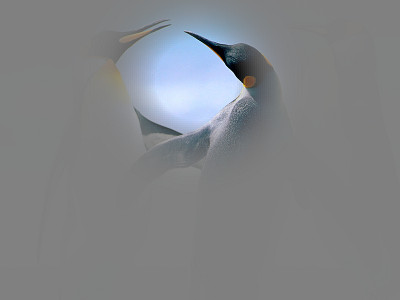

.. _sample03:

Sample 03: Gaze-contingent mask
=======================================================================

What does this sample do?
--------------------------

:ref:`Sample01<sample01>` is a good example of gaze-contingent stimulus, i.e. controlling stimlus according to current gaze position.
In this sample, codes of Sample01 is slightly modified to present a 'window' or 'mask' instead of a small dot on the current gaze position.

Similar to Sample01, a dialog is presented to get necessary information.  Following the first dialog, another dialog is presented to select an image file, which is used as a stimulus.
After selecting image file, calibration starts in the same way as Sample01.
Immediately after calibration is finished, the selected image file is presented on the screen and 'window' is presented on the image (Figure 1).
The 'window' moves according to the current gaze position.

When space key is pressed, size of the 'window' is enlarged.  When space key is pressed five times, the script is terminated.

    
    Figure 1

Codes (PsychoPy)
------------------

- :download:`Download source code (sample03_movingwindow_PsychoPy.py)<sample03_movingwindow_PsychoPy.py>`

Major modifications from Sample01 are shown below.
In the following part, a PIL object for the 'window' stimulus is created.
Size of the texture is 512x512, and format of the texture is 'RGBA'.
All channels are filled with 128, resulting in a transparent gray square.
This texture will be redrawn later.

Please note that size of the stimulus is set to double of the screen size.
This guarantees that the image is covered by the mask stimulus even when the current gaze position moves to the edge of the screen.
Of course, you can use a huge texture (like 2048x2048 or 4096x4096) instead of expanding stimulus size if your graphic card can manage it.

.. code-block:: python
    :emphasize-lines: 8

    maskImageSize = 512
    meshx,meshy = numpy.meshgrid(range(-maskImageSize/2,maskImageSize/2),range(-maskImageSize/2,maskImageSize/2))
    imgArray = numpy.ones((maskImageSize,maskImageSize,4),numpy.uint8)*128
    maskimage = Image.fromarray(imgArray,mode='RGBA')

    stim = psychopy.visual.SimpleImageStim(win,fname)
    mask = psychopy.visual.PatchStim(win,maskimage)
    mask.setSize((max(win.size)*2,max(win.size)*2))

In the following part, a transparent 'window' is drawn on the texture.
Please note that only 4th channel (i.e. alpha channel) is modified.

.. code-block:: python

    for tr in range(5):
        windowSize = 6.0*(tr+1)
        imgArray[:,:,3] = 255*(1-numpy.exp(-(meshx/windowSize)**2-(meshy/windowSize)**2))
        maskimage = Image.fromarray(imgArray,mode='RGBA')
        mask.setTex(maskimage)

In the following part, positin of the mask stimulus is updated.
If the first element of returned value of :func:`~GazeParser.TrackingTools.ControllerPsychoPyBackend.getEyePosition` is None, SimpleGazeTracker currently lose gaze position.
In such a case, position of the mask stimulus is not updated.
In addition, position of the mask stimulus is not updated when current gaze position is outside of the screen.
Current gaze position often goes outside of the screen when participant makes a blink.
If position of the mask stimulus is updated in such a case, the mask stimulus goes outside of the screen and participant can see unmasked image briefly near the time of blinking.

.. code-block:: python

            exy = tracker.getEyePosition()
            if exy[0] != None:
                if -win.size[0]/2<exy[0]<win.size[0]/2 and -win.size[1]/2<exy[1]<win.size[1]:
                    maskcenter = (exy[0],exy[1])
            
            mask.setPos(maskcenter,units='pix')

Codes (VisionEgg)
------------------

- :download:`Download source code (sample03_movingwindow_VisionEgg.py)<sample03_movingwindow_VisionEgg.py>`

Please read comments on codes for PsychoPy.

Here is an another sample in which a blurred circular mask is presented at the current gaze position.

- :download:`Download source code (sample03_movingmask_VisionEgg.py)<sample03_movingmask_VisionEgg.py>`

