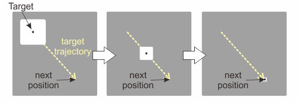

.. _sample04:

Sample 04: Dynamic calibration target
=======================================================================

What does this sample do?
--------------------------

This is an example of :func:`GazeParser.TrackingTools.BaseController.updateCalibrationTargetStimulusCallBack`.
This method allows us to modify the calibration target frame by frame during calibration process.

This sample performs only calibration.  Initialization processes is the same as those in :ref:`sample01`.
The calibration target is presented on the center of the screen at the beginning of calibration.
As shown in Figure 1, the target is a small black square surrounded by a large write square.
When space key is pressed, the target starts moving to a new position.
The surrounding white square becomes smaller as the target approaches to the new position.

    
    Figure 1

Codes (PsychoPy)
------------------

- :download:`Download source code (sample04_dynamiccaltarget_PsychoPy.py)<sample04_dynamiccaltarget_PsychoPy.py>`

Following codes replaces calibration target. The parameter of :func:`~GazeParser.TrackingTools.ControllerPsychoPyBackend.setCalibrationTargetStimulus` must be a stimulus object or a list of stimulus objects.
Here 'stimulus object' indicates that objects that can be renderd to the window by **draw()** method.
If a list of stimulus object is provided, they are drawn from the top of the list.
In this case, a white (fillColor=(1,1,1)) rectangle is drawn first. Then, a black rectangle (fillColor=(-1,-1,-1)) is drawn on the white rectangle.

.. code-block:: python
    
     calstim = [psychopy.visual.Rect(win,width=3,height=3,units='pix',lineColor=(1,1,1),fillColor=(1,1,1)),
                psychopy.visual.Rect(win,width=2,height=2,units='pix',lineColor=(-1,-1,-1),fillColor=(-1,-1,-1))]
     tracker.setCalibrationTargetStimulus(calstim)

Following codes update the size of calibration target frame by frame.
This is a *callback' function*, which is automatically called by :func:`GazeParser.TrackingTools.BaseController.doCalibraion' and :func:`GazeParser.TrackingTools.BaseController.doValidation` during calibration and validation.

.. code-block:: python

     def callback(self, t, index, targetPos, currentPos):
         if index==0:
             return
         else:
             if t<1.0:
                 self.caltarget[0].setSize(((10-9*t)*3,(10-9*t)*3))
             else:
                 self.caltarget[0].setSize((3,3))

     type(tracker).updateCalibrationTargetStimulusCallBack = callback

This callback function receives four parameters shown in Table 1.
In this sample, the size of the calibration target is changed from 30 to 3 depending on the value of *t*.
*self.caltarget* holds stimulus object(s) registered by :func:`~GazeParser.TrackingTools.ControllerPsychoPyBackend.setCalibrationTargetStimulus`.
If :func:`~GazeParser.TrackingTools.ControllerPsychoPyBackend.setCalibrationTargetStimulus` is not used, self.caltarget holds a psychopy.visual.Rect object as default.

.. table:: Table 1

    ================ ============================================================
    Parameter        Description
    ================ ============================================================
    t                time spent for current target position. The unit is seconds.
                     The range of t is 0.0<=t<2.0.  When 0.0<=t<1.0, 
                     the calibration target is moving to the current position.
                     When 1.0<=t<2.0, the calibration target stays on 
                     the current position.
                     Calibration data is sampled when 1.4<t<1.8.
    index            This value represents the order of current target position.
                     This value is 0 before calibration is initiated by space key
                     press.  If the target is moving to or stays on 5th position,
                     this value is 5.
    targetPosition   A tuple of two values.  The target is moving to or stays on 
                     the position indicated by this parameter.
    currentPosition  A tuple of two values that represents current  calibration
                     target position.  This parameter is equal to targetPosition
                     when 1.0<=t<2.0.
    ================ ============================================================

If you have to access the entire list of calibration target positions, you can refer following data attributes of :func:`GazeParser.TrackingTools.BaseController`.

.. table:: Table 2

    ================= =========================================================================
    Attributes         Description
    ================= =========================================================================
    self.caltarget    This attribute holds stimulus object(s) for drawing calibration target.
                      This attribute is set by :func:`~GazeParser.TrackingTools.ControllerPsychoPyBackend.setCalibrationTargetStimulus`.
    self.calTargetPos This attribute holds a list of calibration target positions.
                      This attribute is set by :func:`~GazeParser.TrackingTools.ControllerPsychoPyBackend.setCalibrationTargetPositions`.
    self.valTargetPos This attribute holds a list of validation target positions.
                      This list is internally generated from self.calTaretPos everytime 
                      :func:`~GazeParser.TrackingTools.BaseController.doValidation` is called.
    self.indexList    This attlibute holds the order in which calibration target visits
                      positions listed in self.calTargetPos or self.valTargetPos.
                      That is, if the target is staying on the 5th position in 
                      self.caliTargetPos, self.calTargetPos[self.indexlist[5]] is the position 
                      of the target.
    ================= =========================================================================

Codes (VisionEgg)
------------------

- :download:`Download source code (sample04_dynamiccaltarget_VisionEgg.py)<sample04_dynamiccaltarget_VisionEgg.py>`

Please read comments on the codes for PsychoPy.
The main difference is that :func:`~GazeParser.TrackingTools.ControllerVisionEggBackend.setCalibrationTargetStimulus` must be an object or a list of objects of VisionEgg stimlus.

.. code-block:: python
    
    calstim = [VisionEgg.MoreStimuli.Target2D(size=(5,5),color=(1,1,1)),
               VisionEgg.MoreStimuli.Target2D(size=(2,2),color=(0,0,0))]
    tracker.setCalibrationTargetStimulus(calstim)
    
    def callback(self, t, index, targetPos, currentPos):
        if index==0:
            return
        else:
            if t<1.0:
                self.caltarget[0].parameters.size = ((20.0-19.0*t)*5,(20.0-19.0*t)*5)
            else:
                self.caltarget[0].parameters.size = (5,5)
    
    type(tracker).updateCalibrationTargetStimulusCallBack = callback
