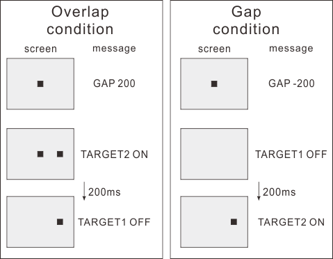
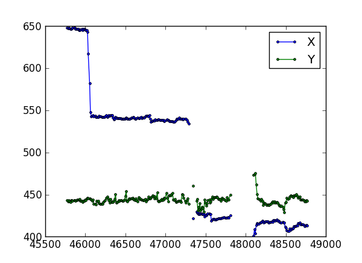

Tutorial 01: Basic data analysis
=============================================================

This example shows a way to use the GazeParser library from IPython shell.
Suppose that a GazeParser data file named 'data.db' exists in the current directory.
To load this data file, import GazeParser module at first.

.. sourcecode:: ipython

    In [1]: import GazeParser

The GazeParser data file can be loaded using :func:`~GazeParser.Utility.load` function.

.. sourcecode:: ipython

    In [2]: GazeParser.load('data.db')
    Out[2]: 
    ([<GazeParser.Core.GazeData at 0x51a6d50>,
     <GazeParser.Core.GazeData at 0x51b8970>,
     <GazeParser.Core.GazeData at 0x53dfb50>,
     <GazeParser.Core.GazeData at 0x5408a70>],
    None)

If data.db is in a subdirectory named experiment01/participant02, use relative path to specifile the file location.

.. sourcecode:: ipython

    In [3]: GazeParser.load('experiment01/participant02/data.db')
    Out[3]: 
    ([<GazeParser.Core.GazeData at 0x51a6d50>,
     <GazeParser.Core.GazeData at 0x51b8970>,
     <GazeParser.Core.GazeData at 0x53dfb50>,
     <GazeParser.Core.GazeData at 0x5408a70>],
    None)

GazeParser.load() returns a tuple of two elements. The first element is a list of :class:`~GazeParser.Core.GazeData` objects.
Number of objects corresponds to how many times you have called the pair of startRecording() and stopRecording() when the data was recorded.
The second element is an 'additional data', which can be appended when the GazeParser data file was generated.
In this example, no additonal data is appended.
For ease of accessing data, let's reload the data file so that we can access the list of GazeParser.Core.GazeData objects with 'd'.

.. sourcecode:: ipython

    In [4]: d,a = GazeParser.load('data.db')
    In [5]: d
    Out[5]: 
    [<GazeParser.Core.GazeData at 0x51a6b30>,
     <GazeParser.Core.GazeData at 0x53f3e70>,
     <GazeParser.Core.GazeData at 0x53e4f70>,
     <GazeParser.Core.GazeData at 0x5400170>]

GazeParser.Core.GazeData object has following data attributes.
Using these attributes, you can calculate how many saccades were made within a certain period,
total duration of fixation on a given region, how long did it take to make a saccade to a suddenly appeared stimulus,
and so on.

=========== =============================================================================
attribute
=========== =============================================================================
nSac        Number of saccades detected in this data block.
Sac         A list of :class:`~GazeParser.Core.SaccadeData` objects.
            Length of this list is equal to nSac.
nFix        Number of fixations detected in this data block.
Fix         A list of :class:`~GazeParser.Core.FixationData` objects.
            Length of this list is equal to nFix.
nBlink      Number of blinks detected in this data block.
Blink       A list of :class:`~GazeParser.Core.BlinkData` objects.
            Length of this list is equal to nBlink.
nMsg        Number of messages inserted in this data block.
Msg         A list of :class:`~GazeParser.Core.MessageData` objects.
            Length of this list is equal to nMsg.
=========== =============================================================================

In this example, eye movements during performing Gap/Overlap task was recorded in the data file.
In the Gap/Overlap task, participant fixated on a central target at the beginning of a trial.
After an interval of random duration, a peripheral target was appeared at the left or right of the central target.
Participant made a saccade as quickly as possible to the peripheral target.
In *GAP tials*, the central target disappeared before the onset of the peripheral target.
Contorary, in *Overlap trials*, the central target disappeared after the onset of the peripheral target.

Three messages were inserted in a trial.
The first message was inserted when the trial was started.
The message indicates condition of the trial.
If the value following 'GAP ' in the message string is negative, the central target disappeared before the onset of the peripheral target (GAP trial).
If positive, the central target disappeared after the onset of the peripheral target (Overlap tial).
Absolute value indicates duration of gap or overlap period.
In a single data block, 20 trials were performed.

You can check all messages in a data block using :func:`~GazeParser.Core.GazeData.getMessageTextList` method.

.. sourcecode:: ipython

    In [6]: d[0].getMessageTextList()
    Out[6]: 
    ['GAP 200',
     'TARGET1 OFF',
     'TARGET2 ON',
     'GAP -200',
     'TARGET1 OFF',
     'TARGET2 ON',
     'GAP -200',
     ... (snip)

It is known that latency of saccade (i.e. time of saccade onset from the onset of the peripheral target) is 
shorter in the gap condition compared to that in the overlap condition.

An easy way to calculate latency with the GazeParser library is to use :func:`~GazeParser.Core.GazeData.getNextEvent` method.
This method returns the event (ie. saccade, fixation, blink or message) which followed the given event.
In this example, the third message was 'TARGET2 ON', which was inserted when the peripheral target was appeared.
To find the saccade following this message, call getNextEvent() like this.

.. sourcecode:: ipython

    In [7]: sac = d[0].getNextEvent(d[0].Msg[2],eventType='saccade')

Note that index of list starts with 0 in python. The saccade onset time is saved to 'startTime' attribute.

.. sourcecode:: ipython

    In [8]: sac.startTime
    Out[8]: 2204.5

'startTime' holds the time from the beginning of the data block.
To get the saccade onset time relative to other event, use :func:`~GazeParser.Core.SaccadeData.relativeStartTime` method.
Latency of this saccade was 302.8 ms.

.. sourcecode:: ipython

    In [9]: sac.relativeStartTime(d[0].Msg[2].time)
    Out[9]: 302.79999999999995

To print latency of all saccades, use **for** statement. Not only :class:`~GazeParser.Core.GazeData` but also 
:class:`~GazeParser.Core.SaccadeData`, :class:`~GazeParser.Core.FixationData`, :class:`~GazeParser.Core.BlinkData`
and :class:`~GazeParser.Core.MessageData` have getNextEvent() method.

.. sourcecode:: ipython

    In [10]: for message in d[0].Msg:
        ...:     if message.text == 'TARGET2 ON':
        ...:         sac = message.getNextEvent(eventType='saccade')
        ...:         print sac.relativeStartTime(message.time)
    302.8
    329.8
    360.4
    347.0
    374.7
    369.1
    276.6
    2161.1
    244.7
    315.4
    246.8
    319.0
    241.9
    65.1
    272.5
    2085.2
    268.1
    220.1
    255.0
    271.5

There are unreasonably large values (>2000) in the output.
A best way to see what happened in these trials is to inspect raw data.
:func:`~GazeParser.Graphics.quickPlot` is a helpful function in such a situation.
In the following example, the 16th output value (2085.2) is examined.
Because three messages were recorded in one trial, either (3*15+1)th or (3*15+2)th message should be 'TARGET2 ON'.

.. sourcecode:: ipython

    In [11]: d[0].Msg[3*15+1].text
    Out[11]: 'TARGET2 ON'
    In [12]: d[0].Msg[3*15+2].text
    Out[12]: 'TARGET1 OFF'

If the particiant had made a saccade to this target, a saccade should have recorded between the (3*15+1)th and (3*16)th message
(i.e., between the onset of the target and the beginning of the next trial).

.. sourcecode:: ipython

    In [13]: start = d[0].Msg[3*15+1].time
    In [14]: end = d[0].Msg[3*16].time
    In [15]: from GazeParser.Graphics import quickPlot
    In [16]: quickPlot(d[0],period=(start,end),style='XYT')

Saccade detection was failed because of missing data although the participant made a saccade in this case.

In the following example, the saccade latencies in the Gap and Overlap trials were calculated while excluding too short (<100) or too long (>500) latency trials.

.. sourcecode:: ipython

    In [17]: latencyList = []
        ...: for message in d[0].Msg:
        ...:     if message.text == 'TARGET2 ON':
        ...:         sac = message.getNextEvent(eventType='saccade')
        ...:         latency = sac.relativeStartTime(message.time)
        ...:         if 100 <= latency <= 500:
        ...:             latencyList.append(latency)
        ...: numpy.mean(latencyList)
    Out[17]: 295.02456215994357

To examine whether the mean saccade latency in the Gap condition is shorter than that in the Overlap condition, the mean saccade latencies for the Gap and Overlap condition must be calculated separately.
Save following script to a file (e.g. calcMeanLatency.py) and run it from IPython.::

    import numpy
    import GazeParser
    
    gapLatency = []
    overlapLatency = []
    
    data,adata = GazeParser.load('data.db')
    
    for d in data:
        for trial in range(20):
            if d.Msg[3*trial].text == 'GAP 200': #overlap condition
                msg = d.Msg[3*trial+1] #TARGET2 ON should be the (3*trial+1)th message in this condition
                sac = msg.getNextEvent(eventType='saccade')
                latency = sac.relativeStartTime(msg.time)
                if 100 <= latency <= 500:
                    overlapLatency.append(latency)
            else: #gap condition
                msg = d.Msg[3*trial+2] #TARGET2 ON should be the (3*trial+2)th message in this condition
                sac = msg.getNextEvent(eventType='saccade')
                latency = sac.relativeStartTime(msg.time)
                if 100 <=latency <= 500:
                    gapLatency.append(latency)
    
    print 'Gap: %.1f\tOverlap: %.1f' % (numpy.mean(gapLatency),numpy.mean(overlapLatency))

.. sourcecode:: ipython

    In [18]: run calcMeanLatency.py
    Gap: 265.9      Overlap: 325.5

In this example, spatial propaties of saccades such as the starting point, termination point and amplitude was not considered.
If you want to check these properties, use data attributes of :class:`~GazeParser.Core.SaccadeData`.

.. sourcecode:: ipython

    In [18]: sac = d[0].getNextEvent(d[0].Msg[2],eventType='saccade')
    In [19]: sac.amplitude #saccade amplitude in deg
    Out[19]: 4.3259570183555649
    In [20]: sac.length #saccade amplitude in pixel
    Out[20]: 104.95837270079979
    In [21]: sac.start #starting point in the screen coordinate
    Out[21]: (521.89999999999998, 437.30000000000001)
    In [22]: sac.end #termination point in the screen coordinate
    Out[22]: (626.79999999999995, 440.80000000000001)

